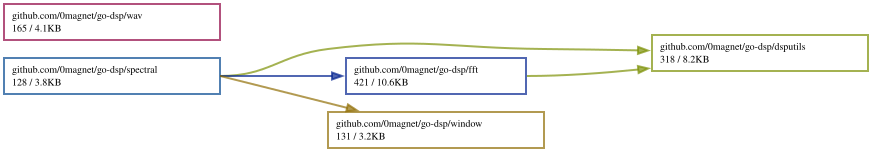

# GO-DSP

A fork of **[go-dsp](https://github.com/madelynnblue/go-dsp)** by Madelynn Blue —
a digital signal processing package for the
[Go programming language](http://golang.org). The code here is upstream's, under
its ISC license; see [LICENSE](LICENSE) and the notice at the head of each file.
This fork exists to carry small changes and to be importable under this path.

**Live demo** — this package has no demo of its own, being a library, but the
FFT here is what draws the spectrogram in
[audioprism-go](https://github.com/0magnet/audioprism-go), which
[chaosrack](https://github.com/0magnet/chaosrack) embeds. So it can be watched
transforming live audio at
**[0magnet.github.io/chaosrack](https://0magnet.github.io/chaosrack/)** — pick
the spectrogram or the XY scope.

## Packages

* **[dsputils](https://pkg.go.dev/github.com/0magnet/go-dsp/dsputils)** - utilities and data structures for DSP
* **[fft](https://pkg.go.dev/github.com/0magnet/go-dsp/fft)** - fast Fourier transform
* **[spectral](https://pkg.go.dev/github.com/0magnet/go-dsp/spectral)** - power spectral density functions (e.g., Pwelch)
* **[wav](https://pkg.go.dev/github.com/0magnet/go-dsp/wav)** - wav file reader functions
* **[window](https://pkg.go.dev/github.com/0magnet/go-dsp/window)** - window functions (e.g., Hamming, Hann, Bartlett)

## Installation and Usage

```$ go get github.com/0magnet/go-dsp/fft```

```
package main

import (
        "fmt"

        "github.com/0magnet/go-dsp/fft"
)

func main() {
        fmt.Println(fft.FFTReal([]float64 {1, 2, 3}))
}
```
## Dependency Graph

Made with [goda](https://github.com/loov/goda):

```
go run github.com/loov/goda@latest graph github.com/0magnet/go-dsp/... | dot -Tsvg -o docs/go-dsp-goda-graph.svg
```



## Lines of Code

Made with [gocloc](https://github.com/hhatto/gocloc) (excludes `vendor/`, `node_modules/`, `.git/`):

```
gocloc --not-match-d='(vendor|node_modules|\.git)' .
```

```
-------------------------------------------------------------------------------
Language                     files          blank        comment           code
-------------------------------------------------------------------------------
Go                              17            279            196           1570
YAML                             1              0              7             98
Makefile                         1             14             21             55
Bourne Shell                     1              8             16             30
JSON                             2              0              0             28
Markdown                         1              9              0             20
-------------------------------------------------------------------------------
TOTAL                           23            310            240           1801
-------------------------------------------------------------------------------
```
